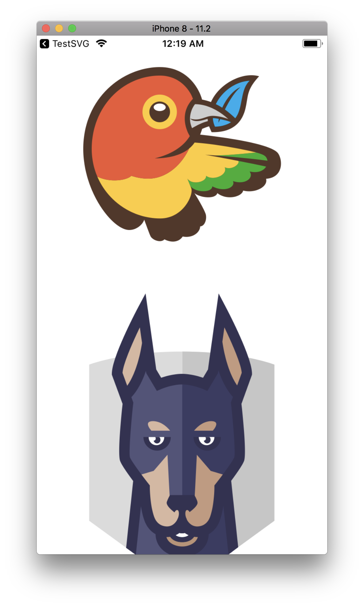
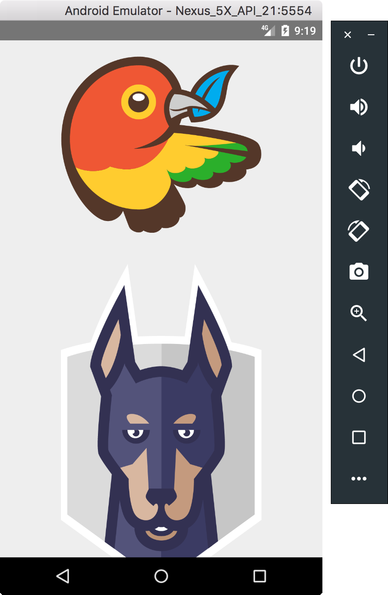

# React Native SVG demo

A simple example app that shows how you can use SVG files in React Native

## Try it

### Step 1: Install depencies to run React Native

Make sure that you have `react-native-cli` installed (`npm install -g react-native-cli`) and [XCode](https://developer.apple.com/xcode/) (for iOS development) / [Android Studio](https://developer.android.com/studio/index.html) (for Android development) installed and working.

- Go to "Building Projects with Native Code" tab and follow the guide: https://facebook.github.io/react-native/docs/getting-started.html

### Step 2: Clone the repo and move to project

```sh
git clone git@github.com:kristerkari/react-native-svg-example.git
cd react-native-svg-example
```

### Step 3: Install example app's dependencies

```sh
npm install
```

### Step 4: Run React Native packager

You can open a new terminal tab to run React Native's packager.

```sh
npm start
```

### Step 5: Run app on Android or iOS

First make sure that your Android emulator or iOS simulator is working, then:

```sh
npm run ios
```

or

```sh
npm run android
```

## Screenshots

**iOS - Android**


